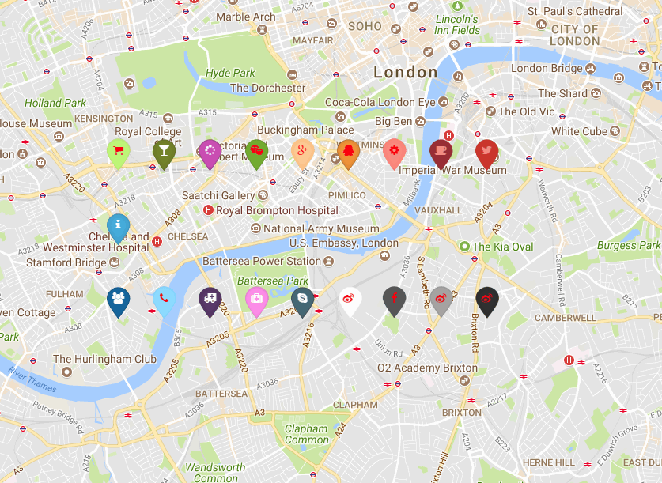

Font Awesome Icons on maptalks

inspired by https://github.com/lvoogdt/Leaflet.awesome-markers

[demo](https://deyihu.github.io/src/maptalks-awesome-markers/examples/)

<pre>
<h2>how  to use?</h2>

 var marker = new maptalks.AwesomeMarker([-0.123049,51.49856], {
        icon:'coffee',
        markerColor:'darkred',
        iconColor: '#f28f82',
      
      });
      marker.addTo(map).show();

</pre>

